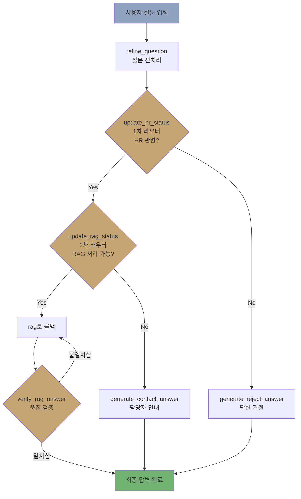

# 가이다 HR 챗봇 🤖

**"왜 자꾸 나한테 물어봐?"에서 시작된 프로젝트**

## 📌 한눈에 보기

- **문제**: 사내문서가 있어도 제대로 정보를 찾지 못해, 결국 담당자에게 직접 물어보는 반복된 문의 발생
- **역할**: 팀장(4인 팀) · 목업 데이터 제작 · 임베딩 테스트 · 벡터DB 파트 · 코드 통합
- **핵심 결정**: 정확성이 최우선인 도메인이라 판단 → 자율 에이전트 대신 고정 워크플로우 채택
- **결과**: 멘토 피드백 — 설계 방향은 적합, 문서량·멀티턴 미지원은 한계로 지적

---

## 🎯 왜 이걸 만들었나

- 경영지원팀 1인 담당자로 일하며, 연차·복지포인트·교육비 등 같은 질문을 반복적으로 받음
- 사내 문서에 답이 있는데도 직원들은 직접 물어보는 쪽을 택함 → 이유를 물어보니:
  > "어디서 찾아야 하는지도 모르겠고, 찾아도 내용이 애매해요. 그냥 물어보는 게 제일 빨라요."
- **문제의 본질**: 정보가 없는 게 아니라, 접근 경로가 불친절해서 담당자에게 직접 묻는 것이 가장 낮은 마찰(low-friction) 경로가 되어버린 것
- LangGraph·RAG를 공부하던 중, "이 반복 질문을 챗봇으로 흡수할 수 있겠다"고 판단, 팀 프로젝트에서 제안 → 아이디어 제안자로서 4인 팀 팀장을 맡음

**해결하려는 문제를 한 문장으로 요약하면:**
"문서는 있지만 못 찾는 문제"를, 담당자를 거치지 않고도 신뢰할 수 있는 답을 즉시 받을 수 있게 만드는 것.

---

## 🧭 핵심 의사결정 3가지

프로젝트를 진행하며 내린 판단 중, 단순 구현이 아니라 **트레이드오프를 저울질한 결정**들을 정리했습니다.

### 1. 데이터 없는 상태에서 무엇을 먼저 다룰 것인가

- **문제**: 실제 사내 정책 문서는 대부분 대외비라 그대로 쓸 수 없음
- **선택**: 여러 HR 영역 중 **복지정책**을 첫 데이터로 선정
- **근거**: 복지정책은 채용 과정에서 지원자에게 어느 정도 공개되는 정보라, 목업으로 재구성해도 실제 회사 정책과 구조적으로 가까운 데이터를 만들 수 있음 (근무정책·보안규정 등 완전 비공개 영역보다 검증 가능성이 높음)
- **트레이드오프**: 커버리지(다양한 HR 영역) 대신 신뢰성 있는 단일 도메인 검증을 우선함
- **결과**: MVP 범위는 좁아졌지만, 실제와 가까운 데이터로 파이프라인 완성도를 높일 수 있었음

### 2. 자율 에이전트가 아니라 고정 워크플로우를 택한 이유

- **쟁점**: LLM이 스스로 다음 행동을 정하는 자율 에이전트 vs. 노드·엣지로 경로를 미리 확정한 고정 파이프라인
- **도메인 특성**: HR 정책은 오답 비용이 큼 — 잘못된 연차·복지 정보 안내는 실제 인사 이슈로 이어질 수 있음
- **비교**: 자율 에이전트는 유연하지만 예측 가능성·검증이 어려움 / 고정 워크플로우는 유연성은 낮지만 같은 질문이 항상 같은 경로를 거쳐 재현·디버깅·검증이 쉬움
- **선택**: 고정 워크플로우 채택
- **트레이드오프**: 자율성·확장 가능성 대신 예측 가능성·정확성을 선택
- **판단 기준**: "이 도메인에서 사용자가 절대 용납하지 못할 실패는 무엇인가"

### 3. 짧은 개발 기간 안에서 범위를 어떻게 줄일 것인가

- **제약**: 10일 스프린트 안에 모든 아이디어를 구현할 수 없음
- **선택**: 멀티턴 대화, 개인화된 응답 등은 이번 범위에서 제외 → "질문 분류 → 답변 생성 → 답변 검증" 핵심 파이프라인의 완성도에 집중하기로 팀 조율
- **트레이드오프**: 기능의 폭 대신, 단발성 질문·답변 시나리오 하나를 확실하게 동작시키는 것을 우선함

---

## 👤 내 역할

4인 팀에서 팀장을 맡았고 기획·의사결정 외에 다음 영역을 직접 담당했습니다.

- **데이터셋 제작**: 복지정책 목업 데이터 설계 및 작성
- **임베딩 테스트**: 한국어 특화 모델과 OpenAI 임베딩 모델 간 성능·리소스 비교 테스트
- **벡터 DB(Pinecone) 파트**: 인덱싱 및 검색 로직 구성
- **코드 통합 및 정리**: 팀원별로 분산 개발된 코드를 하나의 파이프라인으로 통합, 중복 로직 제거
- **구조 단순화 주도**: 프로젝트 후반 AI 코드 점검 중 불필요하게 복잡해진 구조(overengineering) 발견 → 로직 단순화

---

## 📊 결과 및 피드백

- 부트캠프 프로젝트로 정량적 사용자 지표는 없으나, 멘토 피드백으로 설계 방향을 검증받음
- **긍정적 평가**: RAG 답변 신뢰성 확보를 위해 고정 파이프라인 구조를 택한 설계가 목적에 부합
- **한계로 지적된 점**: RAG 문서량이 적고, 멀티턴 대화 미지원
- 해당 피드백은 아래 [향후 계획](#-향후-계획)에 반영

---

## 🚧 한계 및 배운 점

<details>
<summary>펼쳐보기</summary>

- 팀 프로젝트를 처음 이끌며 기술 스택 이해가 부족한 상태에서 예상치 못한 오류를 해결하는 데 시간이 많이 들었습니다.
- 프로젝트 초반 팀원 간 의견 조율에 시간이 오래 걸렸고 이를 개선하기 위해 Notion·Trello·Slack 같은 협업 툴을 적극 도입해 의사결정 속도를 높였습니다.
- 개발 기간이 짧아 완성도보다 핵심 기능 동작에 집중해야 했고 논의됐던 추가 기능(멀티턴, 개인화 등)은 이번 범위에서 제외했습니다.
- 제약이 많은 상황에서도 실제로 동작하는 MVP를 완성했다는 점에서, 좁은 범위를 정확히 정의하고 그 안에서 완성도를 높이는 일의 중요성을 배웠습니다.

</details>

---

## 🔮 향후 계획

- [ ] 추가 HR 문서 데이터셋 확장 (근무정책, 장비보안 규정 등)
- [ ] 한국어 특화 임베딩 모델 성능 비교 분석
- [ ] 멀티턴 대화 지원 (대화 맥락 유지)
- [ ] 개인화된 응답 (직급, 부서별 맞춤 정보)
- [ ] 실시간 문서 업데이트 파이프라인 구축

---

## 🛠 기술 상세 (참고용)

<details>
<summary>아키텍처, 노드 구조, 기술 스택, 설치 방법 펼쳐보기</summary>

### 노드-엣지 구조



**노드 요약**

| 노드 | 역할 | 비고 |
| --- | --- | --- |
| refine_question | 질문 전처리 | 모호한 질문 명확화 |
| update_hr_status | HR 관련 여부 판단 | GPT-4.1-nano |
| update_rag_status | RAG 처리 가능 여부 판단 | GPT-4.1-nano |
| generate_rag_answer | 벡터 검색 + 답변 생성 | Pinecone Top-K 검색, GPT-4.1 |
| verify_rag_answer | 답변-문서 일치 검증 | 불일치 시 재생성 루프 |
| generate_contact_answer | 담당 부서 안내 | 이메일/Slack 채널 제공 |
| generate_reject_answer | 비관련 질문 거절 | 고정 거절 메시지 |

### 기술 스택

- **Core**: LangGraph, LangGraph Studio
- **LLM**: GPT-4.1(본문 생성), GPT-4.1-nano(라우팅)
- **Vector DB**: Pinecone (무료 티어)
- **Embedding**: OpenAI text-embedding-3-small (한국어 특화 모델 대비 메모리 효율성 및 인프라 부담 최소화 목적으로 선택)
- **언어**: Python 3.12

### 데이터

| 파일명 | 내용 | 규모 |
| --- | --- | --- |
| `04_복지정책_v1.0.md` | 사내 복지정책 전반 (휴가, 복지포인트, 교육비, 건강검진, 임신육아 제도 등) | 2,171 토큰 / 3,701 문자 |

### 설치 및 실행

```bash
# 1. 환경 설정
pip install -r requirements.txt

# 2. .env 파일 생성
OPENAI_API_KEY=your_openai_api_key
PINECONE_API_KEY=your_pinecone_api_key
PINECONE_INDEX_NAME=your_index_name

# 3. 벡터 DB 구축 (최초 1회)
cd scripts/
python create_pinecone_index.py

# 4. LangGraph Studio 실행
cd ..
langgraph dev
```

### 사용 예시

**RAG 답변 성공 케이스**
```
👤 "입사 4개월차에는 연차 얼마나 있나요?"
🤖 "입사 4개월 차라면 1년 미만 근속자에 해당하므로, 매달 1개월 만근 시
    1개의 월차가 부여됩니다. 현재까지 최대 4개의 월차가 발생했을 수 있습니다..."
```

**담당자 안내 케이스**
```
👤 "급여 계산에 오류가 있는 것 같은데 어디에 문의해야 하나요?"
🤖 "인사팀으로 문의하시면 정확하고 빠른 답변을 받으실 수 있습니다.
    📧 hr@gaida.play.com  💬 #ask-hr"
```

**질문 거절 케이스**
```
👤 "오늘 날씨가 어때요?"
🤖 "입력하신 질문은 HR 관련 문의가 아닙니다. HR 관련 질문만 가능합니다."
```

### 프로젝트 구조

```
📦 HR-chatbot-development-project/
├── 📂 src/
│   ├── 📄 graph.py                 # LangGraph 워크플로우
│   ├── 📄 nodes.py                 # 각 노드 구현
│   ├── 📄 router.py                # 각 라우터 구현
│   ├── 📄 state.py                 # State 클래스 정의
│   └── 📄 utils.py                 # 유틸리티 함수
├── 📂 data/
│   └── 📄 04_복지정책_v1.0.md       # HR 데이터셋
├── 📂 scripts/
│   └── 📄 create_pinecone_index.py # 벡터DB 초기 설정
├── 📂 tests/                       # 통합 테스트 코드
├── 📂 archive/                     # 팀원별 실험 코드 보관
├── 📄 langgraph.json               # LangGraph Studio 설정
├── 📄 requirements.txt             # 패키지 의존성
└── 📄 README.md                    # 프로젝트 문서
```

### 10일 스프린트 타임라인

- **Day 1-2**: 요구사항 분석 및 아키텍처 설계
- **Day 3**: 가상 회사 데이터 제작 및 벡터DB 구축
- **Day 4-7**: LangGraph 노드 개발 및 라우팅 로직 구현
- **Day 8-9**: 통합 테스트 및 LangGraph Studio 최적화
- **Day 10**: MVP 완성 및 시연 준비

</details>

---
